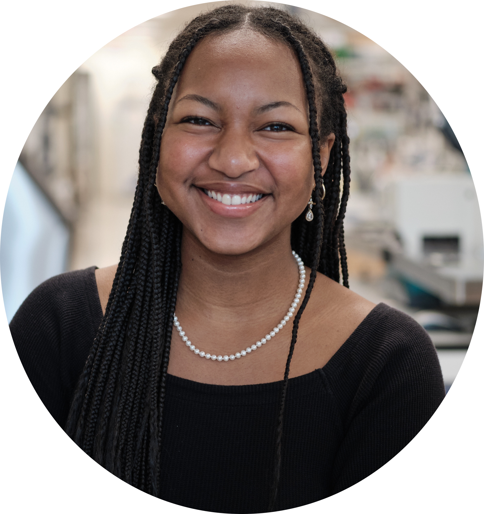

Hello! My name is Mariah, a junior at *Duke University* studying **Biology** and **Computer Science**.   Currently, I am focused on computational biology and biomedical engineering research. :dna: 

Outside of school, I love solving puzzles, vocal performance, and creating art! Feel free to see how I explore my interests further on my blog. More information on my work experience can be found on my projects page.   

#### Education
**Duke University**  
_August 2022 - May 2026_  
B.S. in Biology and Computer Science. Durham, NC  
- **Relevant Coursework:** Molecular Biology, Genetics and Evolution, Data Science (Python & R), Data Structures and Algorithms

icon: envelope
